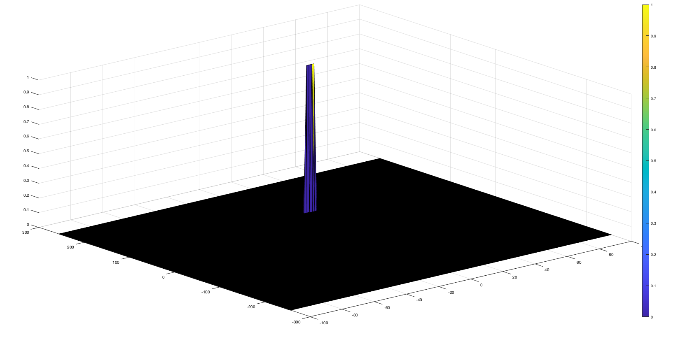

# Radar Target Generation and Detection

This repo contains MatLab code to generate and detect a target in radar data.

## FMCW Waveform Design

radar specifications:
- Carrier frequency, fc = 77 GHz.
- Maximum range of 200 m.
- Range resolution of 1 m.
- Maximum velocity of 100 m/s.
- Number of chirps in one sequence, or number of doppler cells, Nd = 128.
- Number of samples, or number of range cells, Nr = 1024.

From preceding parameters, we get:
- ```B = c / 2 * d_res```, Bandwith of signal
- ```Tchirp = 5.5 * 2 * max_range / c```, chirp time is at least 5-6 times the round trip time
- ```slope = B / Tchirp```, and slope of FMCW chirp.

## Simulation Loop

We define the following target parameters for the simulation:
- initial range of 110 m
- initial velocity of 20 m/s

In terms of wave equation, FMCW transmit and received signals are defined using these wave equations, where ```α = Slopeofthesignal```. The Transmit Signal is given by:


The received signal is nothing but the time delayed version of the Transmit Signal. In digital signal processing the time delayed version is defined by (t−τ), where τ represents the delay time, which in radar processing is the trip time for the signal.

Replacing tt with (t−τ) gives the Receive Signal:


On mixing these two signals, we get the beat signal, which holds the values for both range as well as doppler. By implementing the 2D FFT on this beat signal, we can extract both Range and Doppler information.

The beat signal can be calculated by multiplying the Transmit signal with Receive signal. This process in turn works as frequency subtraction. It is implemented by element by element multiplication of transmit and receive signal matrices.

Mixed or Beat Signal = (Tx.\*Rx)

The above operation gives:


After the simulation is done, we add some random noise to have a more realistic signal.

## Range FFT (1st FFT)

Run the FFT on the beat signal along the range bins dimension (Nr), and we have the following result:


This is showing a target located at 110 meters.

## 2D FFT

Then, the 2D FFT is applied on the signal to generate the corresponding Range Doppler Map (RDM).


This is showing a target located at 110 meters with a speed of 20 m/s.

Let's apply a Cell Averaging Constant False Alarm Rate (CA-CFAR) threshold on this RDM in order to detect the target presence based on the noise estimate.

## Implementation steps for the 2D CA-CFAR process.

- Determine the number of Training cells for each dimension Tr and Td. Similarly, pick the number of guard cells Gr and Gd.
- Determine the offset to be added to average threshold from training cells.
- Slide the Cell Under Test (CUT) across the complete cell matrix.
- Measure and average the noise across all the training cells. This gives the threshold.
- Add the offset (if in signal strength in dB) to the threshold to keep the false alarm to the minimum.
- Determine the signal level at the Cell Under Test.
- If the CUT signal level is greater than the Threshold, assign a value of 1, else equate it to zero.

## Selection of Training, Guard cells and offset.

The number of training cells should be decided based on the environment. If a dense traffic scenario then the fewer training cells should be used, as closely spaced targets can impact the noise estimate. In our case, we are only working with one target, the training cell number may be higher than usual.

The purpose of the Guard Cells is to avoid the target signal from leaking into the training cells that could adversely affect the noise estimate. The number of guard cells should be decided based on the leakage of the target signal out of the cell under test. If target reflections are strong they often get into surrounding bins. For our example, the leakage is quite small thus a small number of guard cells is possible. In the case of automotive application, the guard cells must be high because vehicle are pretty reflective objects.

We use an offset value to scale the noise threshold. If the signal strength is defined in logarithmic form then add this offset value to the average noise estimate, else multiply it.

## Steps taken to suppress the non-thresholded cells at the edges.

Before 2D CA-CFAR process, we initialize three data structures with zeros and their final size of (Nr/2,Nd), as the RDM:
- noise_level, average noise for each CUT.
- threshold_cfar, threshold applied to the CUT (after offset application)
- signal_cfar, final filtered RDM based on threshold

During process, to avoid cells at the edges, we only iterate on cells from 1+Gr+Tr to (Nr/2-(Gr+Tr)) for range dimension and from 1+Gd+Td to (Nd-(Gd+Td)) for doppler dimension.



# Dependencies

- [MatLab](https://fr.mathworks.com/products/matlab.html)
- [MatLab Signal Processing Toolbox](https://fr.mathworks.com/products/signal.html)


# Run

Retrieve the source code:
```
git clone https://github.com/sando92/radar_target_generation_detection.git
```

open ```radar_target_generation_and_detection.m``` with MatLab.
